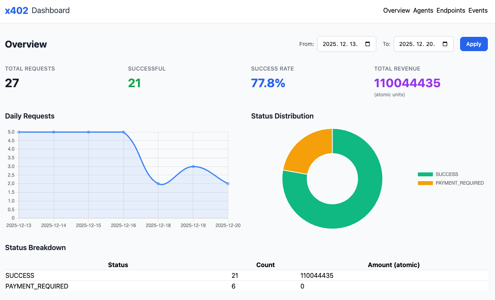
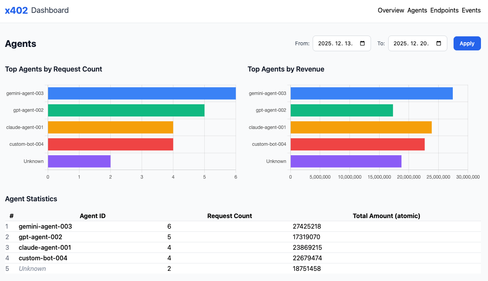
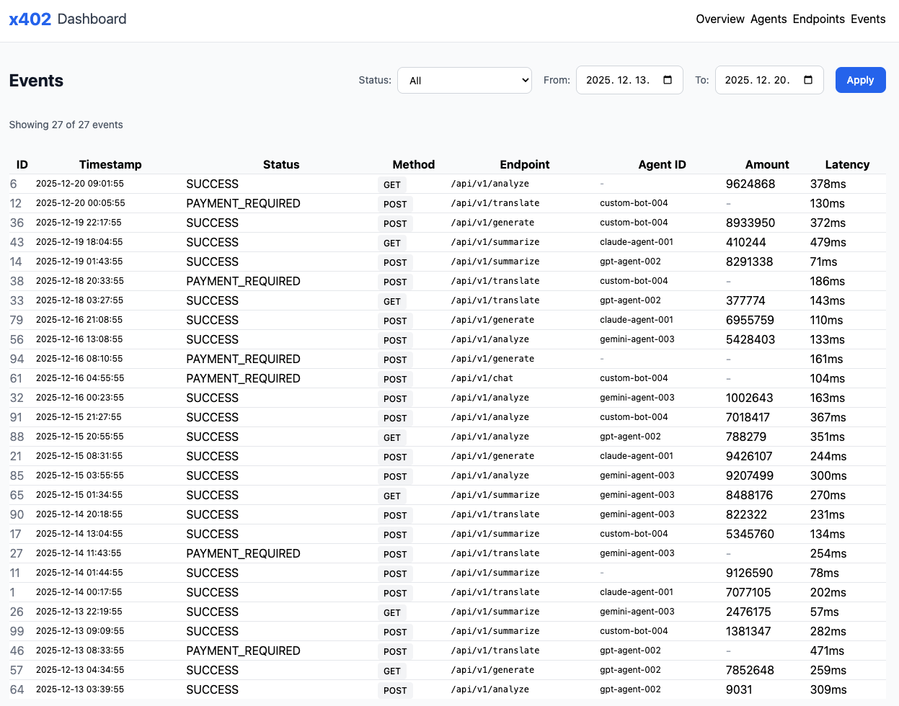

# X402 Dashboard for Spring Boot

[](https://www.oracle.com/java/)
[](https://spring.io/projects/spring-boot)
[](LICENSE)

A lightweight, embeddable dashboard library for monitoring and analyzing HTTP 402 Payment Required transactions in Spring Boot applications. Built specifically for the x402 protocol ecosystem.

**Dual Dashboard Support**: Monitor both sides of x402 transactions - track revenue as a **service provider (seller)** and manage spending as a **service consumer (buyer/agent)**.

## Table of Contents

- [Overview](#overview)
- [Features](#features)
- [Architecture](#architecture)
- [Getting Started](#getting-started)
  - [Prerequisites](#prerequisites)
  - [Installation](#installation)
  - [Quick Start](#quick-start)
- [Usage](#usage)
  - [Basic Integration](#basic-integration)
  - [Manual Event Logging](#manual-event-logging)
  - [Auto-Logging Interceptor](#auto-logging-interceptor)
- [Configuration](#configuration)
- [Project Structure](#project-structure)
- [Testing](#testing)
- [API Documentation](#api-documentation)
- [Screenshots](#screenshots)
- [Contributing](#contributing)
- [Roadmap](#roadmap)
- [License](#license)

## Overview

X402 Dashboard is a Spring Boot starter library that provides real-time monitoring and analytics for HTTP 402 (Payment Required) transactions. It supports **dual perspectives**:

- **Seller Dashboard**: Track incoming payment requests and revenue from your APIs (service provider perspective)
- **Buyer Dashboard**: Monitor outbound payments and spending on external services (AI agent / service consumer perspective)

### What is x402?

The x402 protocol enables **HTTP-native micropayments** using blockchain technology. When a client requests a paid resource, the server responds with `402 Payment Required` along with payment details. After payment verification, the resource is delivered.

**Protocol Version**: This dashboard supports **x402 v2** specification with CAIP-2 network identifiers (e.g., `eip155:84532` for Base Sepolia).

**Seller Dashboard** helps you understand:
- How many payment requests are being made
- Which endpoints generate the most revenue
- Payment success/failure rates
- Client usage patterns
- Transaction settlement times

**Buyer Dashboard** helps you track:
- Total spending across external services
- Cost per service and endpoint
- Budget consumption trends
- Payment success rates
- Service-level cost analysis

## Features

### Seller Dashboard (Service Provider)
Track incoming payment requests and revenue from your APIs:
- **Overview Page**: Total requests, success rate, revenue metrics with time-series charts
- **Agents Page**: Per-agent usage and revenue analysis
- **Endpoints Page**: Endpoint-level performance and revenue tracking
- **Events Page**: Detailed transaction log with filtering and pagination

### Buyer Dashboard (Service Consumer / AI Agent)
Monitor outbound payments and spending on external services:
- **Overview Page**: Total spending, request count, success rate with interactive charts
  - Daily spending trend (line chart)
  - Category breakdown (doughnut chart)
  - Top services by spending (bar chart)
- **Services Page**: Service-level cost analysis and request statistics
- **Transactions Page**: Complete payment history with advanced filtering
  - Filter by date range, service, and payment status
  - Pagination support for large datasets
  - Export-ready transaction details

### Technical Features
- **Dual Dashboard**: Both seller and buyer perspectives in one library
- **Zero Configuration**: Add one annotation and you're ready
- **H2 Database**: In-memory or file-based storage
- **Embedded UI**: Thymeleaf templates with Tailwind CSS and Chart.js
- **RESTful API**: Full programmatic access to dashboard data
- **Auto-Logging**: Optional interceptor for automatic request tracking
- **Multi-Tenant Support**: Track usage across different tenants/services
- **Extensible**: Builder pattern API for custom event logging
- **Demo Data**: Pre-loaded sample data for immediate exploration

## Architecture

```
┌─────────────────────────────────────────────────┐
│           Your Spring Boot Application          │
│                                                  │
│  ┌────────────────────────────────────────┐    │
│  │     @EnableX402Dashboard                │    │
│  └────────────────┬────────────────────────┘    │
│                   │                              │
│  ┌────────────────▼────────────────────────┐    │
│  │   X402DashboardAutoConfiguration        │    │
│  │   • Controllers                          │    │
│  │   • Services                             │    │
│  │   • Repositories                         │    │
│  │   • Interceptors                         │    │
│  └────────────────┬────────────────────────┘    │
│                   │                              │
│  ┌────────────────▼────────────────────────┐    │
│  │          H2 Database                     │    │
│  │     (In-memory or File-based)            │    │
│  └──────────────────────────────────────────┘    │
│                                                  │
│  Access Points:                                  │
│  • /x402-dashboard            → Seller Dashboard UI
│  • /x402-dashboard/api        → Seller Dashboard API
│  • /x402-buyer-dashboard      → Buyer Dashboard UI
│  • /x402-buyer-dashboard/api  → Buyer Dashboard API
│  • /h2-console                → Database Console │
└─────────────────────────────────────────────────┘
```

## Getting Started

### Prerequisites

- Java 17 or higher
- Spring Boot 3.4 or higher
- Gradle 7.5+ or Maven 3.6+

### Installation

#### Option 1: Build from Source (Current)

Since this library is not yet published to Maven Central, you need to build and install it locally:

```bash
# Clone the repository
git clone https://github.com/fortytwo-payments/x402-spring-dashboard.git
cd x402-spring-dashboard

# Build and install to local Maven repository
./gradlew publishToMavenLocal
```

Then add the dependency to your project:

**Gradle:**
```gradle
dependencies {
    implementation 'io.github.fortytwo-payments:x402-spring-dashboard:0.0.1-SNAPSHOT'
}
```

**Maven:**
```xml
<dependency>
    <groupId>io.github.fortytwo-payments</groupId>
    <artifactId>x402-spring-dashboard</artifactId>
    <version>0.0.1-SNAPSHOT</version>
</dependency>
```

#### Option 2: Include as Source (Alternative)

You can also copy the source code directly into your project:

```bash
# Copy the dashboard package into your project
cp -r x402-spring-dashboard/src/main/java/io/x402/dashboard \
      your-project/src/main/java/io/x402/

cp -r x402-spring-dashboard/src/main/resources/templates/x402-dashboard \
      your-project/src/main/resources/templates/
```

> **📦 Maven Central Release**: Coming soon! We plan to publish to Maven Central in the next release (v0.1.0).

### Quick Start

1. **Add the annotation to your Spring Boot application:**

```java
@SpringBootApplication
@EnableX402Dashboard
public class MyApiApplication {
    public static void main(String[] args) {
        SpringApplication.run(MyApiApplication.class, args);
    }
}
```

2. **Run your application:**

```bash
./gradlew bootRun
```

3. **Access the dashboards:**

Open your browser and navigate to:
- **Seller Dashboard**: `http://localhost:8080/x402-dashboard`
- **Buyer Dashboard**: `http://localhost:8080/x402-buyer-dashboard` (requires `x402.buyer.dashboard.enabled=true`)

That's it! You now have a fully functional x402 payment dashboard.

## Usage

### Basic Integration

The simplest integration requires only the `@EnableX402Dashboard` annotation:

```java
@SpringBootApplication
@EnableX402Dashboard
public class Application {
    public static void main(String[] args) {
        SpringApplication.run(Application.class, args);
    }
}
```

### Manual Event Logging

For precise control over what gets logged, inject `X402UsageLogger` and log events manually:

```java
@RestController
@RequestMapping("/api")
public class MyApiController {

    @Autowired
    private X402UsageLogger usageLogger;

    @PostMapping("/resource")
    public ResponseEntity<?> handleRequest(HttpServletRequest request) {

        // Your payment verification logic here...

        // Log successful payment
        usageLogger.logSuccess(
            "agent-123",           // agentId
            "POST",                // method
            "/api/resource",       // endpoint
            "eip155:84532",        // network (CAIP-2 format: Base Sepolia)
            "USDC",                // asset
            1000000L,              // amountAtomic (1 USDC in atomic units)
            "0x1234abcd...",       // txHash
            150L                   // latencyMs
        );

        return ResponseEntity.ok(resource);
    }
}
```

#### Using Builder Pattern

For more complex scenarios, use the builder pattern:

```java
usageLogger.builder()
    .tenantId("tenant-001")
    .agentId("agent-123")
    .agentType(AgentType.CLAUDE)
    .method("POST")
    .endpoint("/api/chat")
    .billingKey("premium-tier")
    .network("eip155:84532")  // CAIP-2 format: Base Sepolia
    .asset("USDC")
    .amountAtomic(500000L)
    .txHash("0xabc123...")
    .status(X402UsageStatus.SUCCESS)
    .clientIp(request.getRemoteAddr())
    .userAgent(request.getHeader("User-Agent"))
    .latencyMs(200L)
    .log();
```

#### Convenience Methods

```java
// Log payment required (402 response)
usageLogger.logPaymentRequired(
    "agent-123", "GET", "/api/data",
    "eip155:84532", "USDC", 2000000L, 50L  // CAIP-2 network format
);

// Log verification failure
usageLogger.logVerifyFailed(
    "agent-123", "POST", "/api/resource", 100L
);

// Log settlement failure
usageLogger.logSettleFailed(
    "agent-123", "POST", "/api/resource", "0x789def...", 120L
);
```

### Auto-Logging Interceptor (Server-side)

Enable automatic logging for all incoming requests:

```properties
x402.dashboard.enable-auto-logging=true
```

The interceptor will:
- Automatically log all HTTP requests
- Map HTTP status codes to x402 usage statuses (402 → `PAYMENT_REQUIRED`, 2xx → `SUCCESS`, etc.)
- Extract x402-specific headers (`X-402-Agent-Id`, `X-402-Network`, `X-402-Asset`)
- Calculate request latency
- Capture client IP and User-Agent

> **Note**: Dashboard endpoints (`/x402-dashboard/**`) are automatically excluded from auto-logging.

### Annotation-Based Auto Logging

Use the `@X402Logged` annotation to automatically log specific method executions:

```java
@Service
public class PaymentService {

    @X402Logged(
        agentId = "buyer-123",
        agentType = AgentType.CUSTOM,
        method = "POST",
        endpoint = "/api/payment",
        network = "eip155:84532",  // Base Sepolia (CAIP-2)
        asset = "USDC",
        amountAtomic = 1000000L    // 1 USDC
    )
    public PaymentResponse processPayment(PaymentRequest request) {
        // Your business logic...
        return response;
    }

    @X402Logged(
        agentId = "agent-456",
        network = "eip155:1",  // Ethereum Mainnet (CAIP-2)
        asset = "ETH"
    )
    public void executeTransaction() {
        // Minimal annotation - uses method name as endpoint
    }
}
```

**Features:**
- **Method-level control**: Apply to specific methods only
- **Automatic status tracking**: SUCCESS if method completes, UNKNOWN_ERROR if exception thrown
- **Latency measurement**: Automatically tracks method execution time
- **Flexible configuration**: All annotation parameters are optional with sensible defaults

**Available annotation parameters:**
- `tenantId`: Tenant identifier (optional)
- `agentId`: Agent/buyer identifier
- `agentType`: Type of agent (CLAUDE, GPT, GEMINI, CUSTOM, etc.)
- `method`: HTTP method or operation type (default: "METHOD_CALL")
- `endpoint`: Resource path (default: fully qualified method name)
- `billingKey`: Billing/pricing tier key
- `network`: Blockchain network in CAIP-2 format (e.g., "eip155:84532")
- `asset`: Token/currency symbol (e.g., "USDC", "ETH")
- `amountAtomic`: Amount in atomic units
- `txHash`: Transaction hash (if available)

### RestTemplate Client-side Auto Logging

Enable automatic logging for outgoing HTTP requests made with `RestTemplate` or `RestClient`:

```properties
x402.dashboard.enable-client-auto-logging=true
```

This automatically adds an interceptor to all `RestTemplate` beans that:
- Logs all outgoing HTTP requests
- Captures request/response latency
- Maps HTTP status codes to usage statuses
- Extracts X-402-* headers from requests

**Manual configuration:**

```java
@Configuration
public class MyConfig {

    @Autowired
    private X402ClientLoggingInterceptor clientLoggingInterceptor;

    @Bean
    public RestTemplate restTemplate() {
        RestTemplate restTemplate = new RestTemplate();
        restTemplate.getInterceptors().add(clientLoggingInterceptor);
        return restTemplate;
    }
}
```

**Using X-402 headers in requests:**

```java
@Autowired
private RestTemplate restTemplate;

public void callExternalService() {
    HttpHeaders headers = new HttpHeaders();
    headers.set("X-402-Agent-Id", "buyer-123");
    headers.set("X-402-Network", "eip155:84532");  // CAIP-2 format
    headers.set("X-402-Asset", "USDC");
    headers.set("X-402-Amount", "1000000");
    headers.set("X-402-TxHash", "0x123abc...");
    headers.set("X-402-Billing-Key", "premium");

    HttpEntity<String> entity = new HttpEntity<>(requestBody, headers);
    ResponseEntity<String> response = restTemplate.exchange(
        url, HttpMethod.POST, entity, String.class
    );

    // Request is automatically logged with extracted header information
}
```

**Comparison of Auto-Logging Approaches:**

| Feature | Server Interceptor | @X402Logged Annotation | RestTemplate Interceptor |
|---------|-------------------|------------------------|--------------------------|
| **Scope** | All incoming requests | Specific methods | All outgoing requests |
| **Use Case** | Service provider (seller) | Flexible logging | Service consumer (buyer) |
| **Configuration** | `enable-auto-logging=true` | Add annotation to methods | `enable-client-auto-logging=true` |
| **Granularity** | Request-level | Method-level | Request-level |
| **Performance** | Minimal overhead | Minimal overhead | Minimal overhead |
| **Metadata** | From HTTP headers | From annotation parameters | From X-402-* headers |

### Buyer Dashboard (Service Consumer Perspective)

Enable the Buyer Dashboard to track outbound payments from your AI agents:

```properties
x402.buyer.dashboard.enabled=true
x402.buyer.dashboard.default-buyer-id=my-agent-001
```

Then log outbound payment events using `X402SpendingLogger`:

```java
@RestController
public class MyAgentController {

    @Autowired
    private X402SpendingLogger spendingLogger;

    @PostMapping("/invoke-service")
    public ResponseEntity<?> invokeExternalService() {
        // Call external x402-enabled service
        // After payment, log the spending event

        spendingLogger.logSuccess(
            "my-agent-001",        // buyerId
            "OpenAI API",          // serviceName
            "/v1/chat/completions", // endpoint
            "eip155:8453",         // network (CAIP-2 format: Base Mainnet)
            "USDC",                // asset
            5000000L,              // amountAtomic (5 USDC)
            "0xabc123...",         // txHash
            250L                   // latencyMs
        );

        return ResponseEntity.ok(result);
    }
}
```

**Buyer Dashboard Features:**
- **Overview**: Total spending, request count, success rate with daily trends
- **Services**: Per-service cost analysis and request statistics
- **Transactions**: Complete payment history with date/service/status filtering

## Network Format (CAIP-2)

This dashboard uses the **CAIP-2** (Chain Agnostic Improvement Proposal) standard for network identifiers, as specified in x402 v2.

### Common Network Identifiers

| Network | CAIP-2 Format | Chain ID |
|---------|---------------|----------|
| Base Sepolia | `eip155:84532` | 84532 |
| Base Mainnet | `eip155:8453` | 8453 |
| Ethereum Mainnet | `eip155:1` | 1 |
| Ethereum Sepolia | `eip155:11155111` | 11155111 |
| Polygon Mainnet | `eip155:137` | 137 |
| Arbitrum One | `eip155:42161` | 42161 |
| Solana Devnet | `solana:devnet` | - |
| Solana Mainnet | `solana:mainnet` | - |

### Format Structure

- **EVM chains**: `eip155:<chainId>`
- **Solana**: `solana:<network>`

Learn more about CAIP-2: https://github.com/ChainAgnostic/CAIPs/blob/main/CAIPs/caip-2.md

## Configuration

Configure the dashboard via `application.properties` or `application.yml`:

### application.properties

```properties
# Seller Dashboard paths
x402.dashboard.path=/x402-dashboard
x402.dashboard.api-path=/x402-dashboard/api

# Buyer Dashboard paths and settings
x402.buyer.dashboard.enabled=false
x402.buyer.dashboard.path=/x402-buyer-dashboard
x402.buyer.dashboard.api-path=/x402-buyer-dashboard/api
x402.buyer.dashboard.default-buyer-id=

# H2 Database settings
x402.dashboard.in-memory=true
x402.dashboard.file-path=./x402-dashboard-db

# Auto-logging interceptor (server-side - incoming requests)
x402.dashboard.enable-auto-logging=false

# Client-side auto-logging (outgoing RestTemplate requests)
x402.dashboard.enable-client-auto-logging=false

# Multi-tenant support
x402.dashboard.default-tenant-id=

# Security (future feature)
x402.dashboard.security-enabled=false
x402.dashboard.security-username=admin
x402.dashboard.security-password=admin
```

### application.yml

```yaml
x402:
  dashboard:
    path: /x402-dashboard
    api-path: /x402-dashboard/api
    in-memory: true
    file-path: ./x402-dashboard-db
    enable-auto-logging: false           # Server-side interceptor (incoming)
    enable-client-auto-logging: false    # Client-side interceptor (outgoing)
    default-tenant-id: ""
    security-enabled: false
    security-username: admin
    security-password: admin
  buyer:
    dashboard:
      enabled: false
      path: /x402-buyer-dashboard
      api-path: /x402-buyer-dashboard/api
      default-buyer-id: ""
```

## Project Structure

```
x402-spring-dashboard/
├── src/
│   ├── main/
│   │   ├── java/io/x402/dashboard/
│   │   │   ├── annotation/
│   │   │   │   └── EnableX402Dashboard.java          # Activation annotation
│   │   │   ├── config/
│   │   │   │   ├── X402DashboardAutoConfiguration.java
│   │   │   │   ├── X402DashboardProperties.java
│   │   │   │   └── X402DemoDataLoader.java
│   │   │   ├── domain/
│   │   │   │   ├── X402UsageEvent.java               # Main entity (seller)
│   │   │   │   ├── X402UsageStatus.java              # Status enum
│   │   │   │   └── AgentType.java                    # Agent type enum
│   │   │   ├── repository/
│   │   │   │   └── X402UsageEventRepository.java     # JPA repository
│   │   │   ├── service/
│   │   │   │   ├── X402UsageEventService.java
│   │   │   │   ├── X402UsageAggregationService.java  # Analytics service
│   │   │   │   └── dto/                              # Data transfer objects
│   │   │   ├── logging/
│   │   │   │   └── X402UsageLogger.java              # Public API for logging
│   │   │   ├── buyer/                                # Buyer Dashboard Module
│   │   │   │   ├── config/
│   │   │   │   │   ├── X402BuyerDashboardProperties.java
│   │   │   │   │   └── X402BuyerDemoDataLoader.java
│   │   │   │   ├── domain/
│   │   │   │   │   ├── X402SpendingEvent.java        # Main entity (buyer)
│   │   │   │   │   └── ServiceCategory.java          # Category enum
│   │   │   │   ├── repository/
│   │   │   │   │   └── X402SpendingEventRepository.java
│   │   │   │   ├── service/
│   │   │   │   │   ├── X402SpendingEventService.java
│   │   │   │   │   ├── X402SpendingAggregationService.java
│   │   │   │   │   └── dto/
│   │   │   │   ├── logging/
│   │   │   │   │   └── X402SpendingLogger.java       # Public API for buyer logging
│   │   │   │   └── web/
│   │   │   │       ├── X402BuyerDashboardController.java
│   │   │   │       └── X402BuyerDashboardRestController.java
│   │   │   └── web/
│   │   │       ├── X402DashboardController.java      # Thymeleaf views (seller)
│   │   │       ├── X402DashboardRestController.java  # REST API (seller)
│   │   │       └── X402UsageLoggingInterceptor.java  # Auto-logging
│   │   └── resources/
│   │       ├── templates/
│   │       │   ├── x402-dashboard/                   # Seller Dashboard Templates
│   │       │   │   ├── layout.html
│   │       │   │   ├── index.html
│   │       │   │   ├── agents.html
│   │       │   │   ├── endpoints.html
│   │       │   │   └── events.html
│   │       │   └── x402-buyer-dashboard/             # Buyer Dashboard Templates
│   │       │       ├── overview.html
│   │       │       ├── services.html
│   │       │       └── transactions.html
│   │       └── application.properties
│   └── test/
│       └── java/io/x402/dashboard/
│           ├── ApplicationTests.java
│           ├── X402DemoDataTest.java
│           └── buyer/
│               └── X402BuyerDashboardTest.java
├── build.gradle
└── README.md
```

## Testing

### Running Tests

```bash
# Run all tests
./gradlew test

# Run with coverage
./gradlew test jacocoTestReport

# Run specific test class
./gradlew test --tests X402DemoDataTest

# Run buyer dashboard tests
./gradlew test --tests X402BuyerDashboardTest
```

### Running with Demo Data

To see the dashboards in action with sample data:

**Seller Dashboard Demo:**
```bash
./gradlew bootRun --args='--spring.profiles.active=demo'
```

This will:
- Start the application
- Load 100 sample x402 usage events into the seller dashboard
- Access at: http://localhost:8080/x402-dashboard

**Buyer Dashboard Demo:**
```bash
./gradlew bootRun --args='--spring.profiles.active=demo --x402.buyer.dashboard.enabled=true'
```

This will:
- Start the application with buyer dashboard enabled
- Load sample spending events for buyer dashboard
- Access at: http://localhost:8080/x402-buyer-dashboard

### Manual Testing

1. **Start the application:**
   ```bash
   ./gradlew bootRun
   ```

2. **Access the dashboards:**
   - Seller Dashboard UI: http://localhost:8080/x402-dashboard
   - Buyer Dashboard UI: http://localhost:8080/x402-buyer-dashboard
   - H2 Console: http://localhost:8080/h2-console
     - JDBC URL: `jdbc:h2:mem:x402-dashboard`
     - Username: `sa`
     - Password: (leave empty)

3. **Generate test events:**
   ```bash
   curl -X POST http://localhost:8080/x402-dashboard/demo/generate \
     -H "Content-Type: application/json" \
     -d '{"count": 50}'
   ```

### Integration Testing Example

```java
@SpringBootTest
@AutoConfigureMockMvc
class X402DashboardIntegrationTest {

    @Autowired
    private X402UsageLogger logger;

    @Autowired
    private X402UsageEventRepository repository;

    @Test
    void shouldLogAndPersistEvent() {
        // Given
        logger.logSuccess(
            "test-agent", "POST", "/api/test",
            "eip155:84532", "USDC", 1000000L,  // CAIP-2 format
            "0xtest...", 100L
        );

        // When
        List<X402UsageEvent> events = repository.findAll();

        // Then
        assertThat(events).hasSize(1);
        assertThat(events.get(0).getAgentId()).isEqualTo("test-agent");
        assertThat(events.get(0).getStatus()).isEqualTo(X402UsageStatus.SUCCESS);
    }
}
```

## API Documentation

### Seller Dashboard REST API

All Seller Dashboard API endpoints are prefixed with `/x402-dashboard/api`:

#### Overview Statistics
```
GET /x402-dashboard/api/overview
    ?from=2024-01-01T00:00:00Z
    &to=2024-12-31T23:59:59Z
    &tenantId=optional-tenant-id
```

Returns total counts, success rate, and revenue.

#### Agent Analytics
```
GET /x402-dashboard/api/agents/top
    ?from=2024-01-01T00:00:00Z
    &to=2024-12-31T23:59:59Z
    &tenantId=optional-tenant-id
```

Returns aggregated usage by agent ID.

#### Endpoint Analytics
```
GET /x402-dashboard/api/endpoints/top
    ?from=2024-01-01T00:00:00Z
    &to=2024-12-31T23:59:59Z
    &tenantId=optional-tenant-id
```

Returns aggregated usage by endpoint.

#### Status Distribution
```
GET /x402-dashboard/api/status
    ?from=2024-01-01T00:00:00Z
    &to=2024-12-31T23:59:59Z
    &tenantId=optional-tenant-id
```

Returns distribution of statuses (SUCCESS, PAYMENT_REQUIRED, etc.).

#### Daily Trends
```
GET /x402-dashboard/api/daily
    ?from=2024-01-01T00:00:00Z
    &to=2024-12-31T23:59:59Z
    &tenantId=optional-tenant-id
```

Returns daily aggregated metrics.

#### Event Log
```
GET /x402-dashboard/api/events
    ?from=2024-01-01T00:00:00Z
    &to=2024-12-31T23:59:59Z
    &status=SUCCESS
    &page=0
    &size=20
```

Returns paginated event list with optional filtering.

#### Recent Events
```
GET /x402-dashboard/api/events/recent?limit=10
```

Returns the most recent events.

### Response Examples

**Overview Response:**
```json
{
  "totalCount": 1500,
  "successCount": 1350,
  "successRate": 90.0,
  "totalAmountAtomic": 15000000000,
  "from": "2024-01-01T00:00:00Z",
  "to": "2024-12-31T23:59:59Z"
}
```

**Agent Analytics Response:**
```json
[
  {
    "agentId": "agent-001",
    "requestCount": 450,
    "totalAmountAtomic": 4500000000,
    "avgLatencyMs": 125.5
  },
  {
    "agentId": "agent-002",
    "requestCount": 380,
    "totalAmountAtomic": 3800000000,
    "avgLatencyMs": 98.2
  }
]
```

### Buyer Dashboard REST API

All Buyer Dashboard API endpoints are prefixed with `/x402-buyer-dashboard/api`:

#### Spending Overview
```
GET /x402-buyer-dashboard/api/overview
    ?buyerId=my-agent-001
    &from=2024-01-01T00:00:00
    &to=2024-12-31T23:59:59
```

Returns total spending, request count, and success rate.

**Response Example:**
```json
{
  "totalSpending": 50000000,
  "requestCount": 125,
  "successCount": 120,
  "successRate": 96.0,
  "from": "2024-01-01T00:00:00Z",
  "to": "2024-12-31T23:59:59Z"
}
```

#### Top Services by Spending
```
GET /x402-buyer-dashboard/api/services/top
    ?buyerId=my-agent-001
    &from=2024-01-01T00:00:00
    &to=2024-12-31T23:59:59
    &limit=10
```

Returns services ranked by total spending.

**Response Example:**
```json
[
  {
    "serviceName": "OpenAI API",
    "requestCount": 45,
    "totalSpending": 22500000,
    "avgLatencyMs": 180.5
  },
  {
    "serviceName": "Anthropic Claude API",
    "requestCount": 38,
    "totalSpending": 19000000,
    "avgLatencyMs": 150.2
  }
]
```

#### Recent Transactions
```
GET /x402-buyer-dashboard/api/transactions/recent
    ?buyerId=my-agent-001
    &limit=10
```

Returns the most recent spending transactions.

#### Daily Spending Trend (Chart Data)
```
GET /x402-buyer-dashboard/api/charts/daily-spending
    ?buyerId=my-agent-001
    &from=2024-01-01T00:00:00
    &to=2024-01-31T23:59:59
```

Returns daily aggregated spending for chart visualization.

**Response Example:**
```json
{
  "2024-01-01": 1500000,
  "2024-01-02": 2300000,
  "2024-01-03": 1800000
}
```

#### Category Spending (Chart Data)
```
GET /x402-buyer-dashboard/api/charts/category-spending
    ?buyerId=my-agent-001
    &from=2024-01-01T00:00:00
    &to=2024-12-31T23:59:59
```

Returns spending breakdown by service category (AI, BLOCKCHAIN, DATA, OTHER).

**Response Example:**
```json
{
  "AI": 35000000,
  "BLOCKCHAIN": 10000000,
  "DATA": 5000000
}
```

## Screenshots

### Overview Dashboard

*Real-time metrics, revenue charts, and status distribution*

### Agent Analytics

*Per-agent usage analysis and revenue tracking*

### Event Log

*Detailed transaction history with filtering*

## Contributing

We welcome contributions! Please follow these guidelines:

### How to Contribute

1. **Fork the repository**
2. **Create a feature branch**: `git checkout -b feature/amazing-feature`
3. **Make your changes**
4. **Write tests** for your changes
5. **Ensure tests pass**: `./gradlew test`
6. **Commit your changes**: `git commit -m 'Add amazing feature'`
7. **Push to the branch**: `git push origin feature/amazing-feature`
8. **Open a Pull Request**

### Code Style

- Follow standard Java coding conventions
- Use meaningful variable and method names
- Write Javadoc for public APIs
- Keep methods focused and concise
- Add unit tests for new functionality

### Reporting Issues

Please use GitHub Issues to report bugs or request features. Include:
- Detailed description of the issue
- Steps to reproduce
- Expected vs actual behavior
- Environment details (Java version, Spring Boot version, etc.)

## Roadmap

### Current Focus (v0.1.0)
- [x] Core dashboard functionality (Seller perspective)
- [x] H2 database integration
- [x] Thymeleaf UI with charts
- [x] REST API for programmatic access
- [x] Auto-logging interceptor
- [x] Demo data generation

### Recently Completed (v0.2.0)
- [x] **Buyer Dashboard** - Track outbound payments from AI agents
  - [x] Overview page with spending analytics
  - [x] Daily spending trends with interactive charts
  - [x] Service-level cost analysis
  - [x] Transaction history with filtering
  - [x] Category breakdown visualization

### Upcoming Features (v0.3.0)
- [ ] Budget monitoring and alerts for Buyer Dashboard
- [ ] Anomaly detection for unusual spending patterns
- [ ] Spring Security integration (Basic Auth / Form Login)
- [ ] PostgreSQL/MySQL support
- [ ] CSV/Excel export functionality

### Future Enhancements (v0.3.0+)
- [ ] Real-time updates (WebSocket/SSE)
- [ ] Advanced filtering and search
- [ ] Custom dashboards and widgets
- [ ] Alerting system (Email, Slack, Webhooks)
- [ ] Dark mode support
- [ ] Internationalization (i18n)
- [ ] Performance optimizations for high-volume scenarios
- [ ] Docker support and container deployment guides

### Community Requests
See our [GitHub Issues](https://github.com/fortytwo-payments/x402-spring-dashboard/issues) for community-requested features.

## License

This project is licensed under the Apache License 2.0 - see the [LICENSE](LICENSE) file for details.

## Acknowledgments

- Built with [Spring Boot](https://spring.io/projects/spring-boot)
- UI powered by [Tailwind CSS](https://tailwindcss.com/) and [Chart.js](https://www.chartjs.org/)
- Inspired by the [x402 protocol](https://github.com/fortytwo-payments/x402-spec) for HTTP-native micropayments

## Support

- **Documentation**: See [claude-readme.md](claude-readme.md) for detailed design specifications
- **Issues**: [GitHub Issues](https://github.com/fortytwo-payments/x402-spring-dashboard/issues)
- **Discussions**: [GitHub Discussions](https://github.com/fortytwo-payments/x402-spring-dashboard/discussions)
- **Email**: support@x402.io

---

**Made with ❤️ for the x402 ecosystem**
